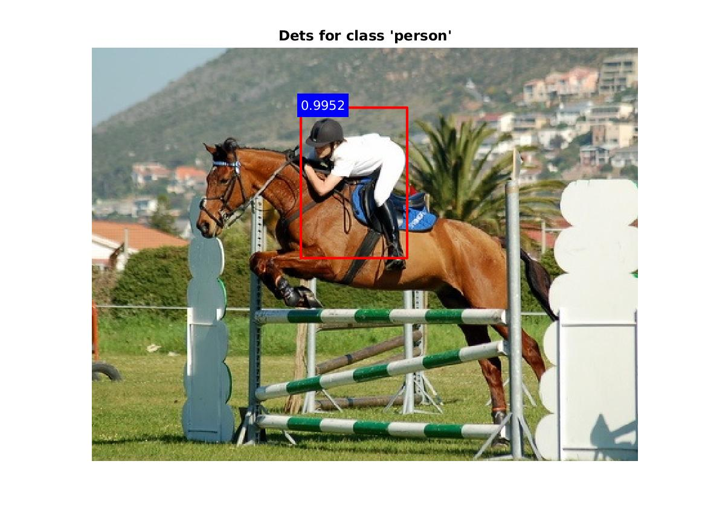

R-FCN
---

This repo contains code to download and evaluate the R-FCN object detector 
described in the [paper](https://www.robots.ox.ac.uk/~vgg/rg/papers/dai16nips.pdf):

```
"R-fcn: Object detection via region-based fully convolutional networks."  
by Jifeng Dai, Li, Yi, Kaiming He, and Jian Sun (NIPS. 2016).
```

The implementation is based on the `py-caffe` code made
[available](https://github.com/Orpine/py-R-FCN) by [Yuwen Xiong](https://github.com/YuwenXiong).  Pre-trained models released with the caffe code which have been imported into matconvnet can be downloaded [here](http://www.robots.ox.ac.uk/~albanie/models.html#r-fcn-models).

### Demo

Running the `rfcn_demo.m` script will download a model trained on `pascal voc 2007+2012` data and run it on a sample image to produce the figure below:



### Functionality

There are scripts to evaluate models on the `pascal voc` and `mscoco` datasets.  The training code is still in the verfication process.

### Installation

This module can be installed with the MatConvNet `vl_contrib` package manger.  Due to the significant similarity in model design, this code re-uses part of the `mcnFasterRCNN` implementation. The following modules are required (these can also be installed with `vl_contrib`):

* [autonn](https://github.com/vlfeat/autonn) - a wrapper module for matconvnet
* [GPU NMS](https://github.com/albanie/mcnNMS) - a CUDA-based implementation of non-maximum supression
* [mcnFasterRCNN](https://github.com/albanie/mcnFasterRCNN) - MatConvNet Faster R-CNN
  
### Performance

The scores produced by the pretrained models are listed on the [model page](http://www.robots.ox.ac.uk/~albanie/models.html#r-fcn-models).  Running the detector with on multiple GPUs produces a significant speed boost during inference.  Timings are shown below for the model based on the `ResNet 50` and `ResNet 101` models, averaged over a portion of the `pascal 2007` test set using a Tesla M40 GPU with a single image minibatch.  These benchmarks should be considered extremely apprxoimate - the variance on each image is high (due to differing input sizes), and they do not include the final short round of NMS :


| model      | Single GPU | 2 GPUs   |
|------------|-----------|-----------|
| ResNet-50  | 8.3 Hz    | 12.9 Hz   |
| ResNet-101 | 4.2 Hz    | 7 Hz      |
